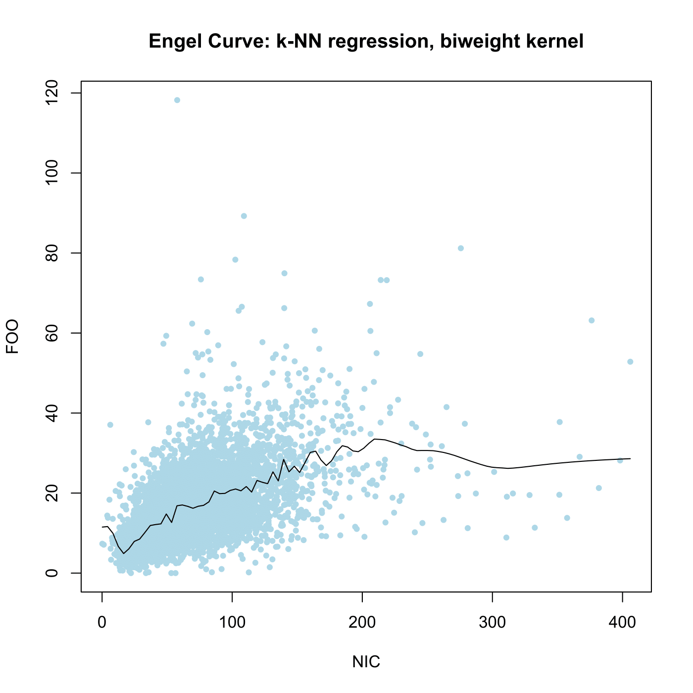
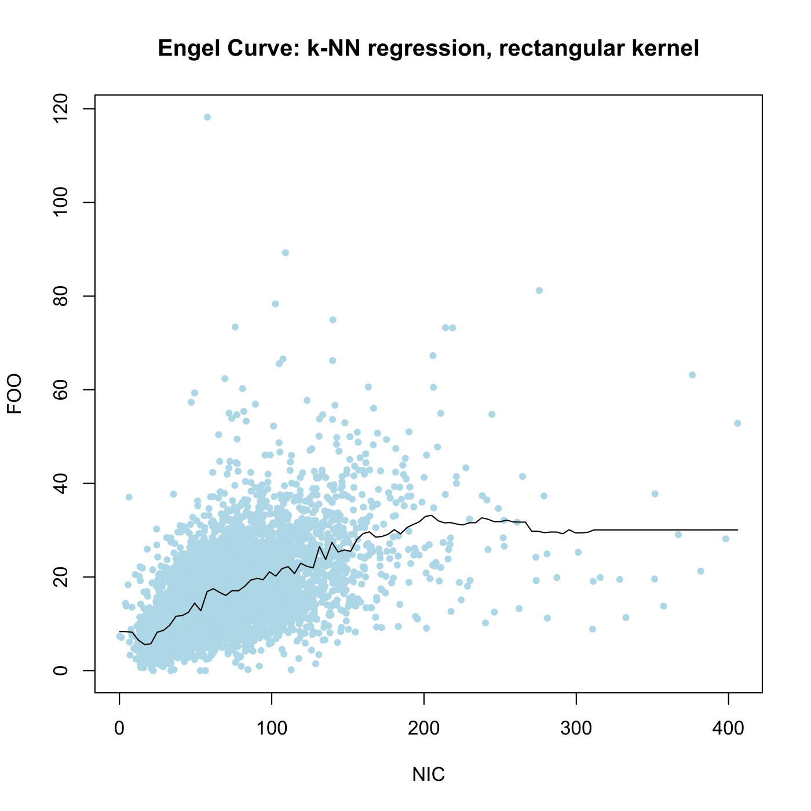

[](http://quantlet.de/index.php?p=info)

## [](http://quantlet.de/) **SPMknnreg** [](http://quantlet.de/d3/ia)

```yaml

Name of QuantLet : SPMknnreg

Published in : Nonparametric and Semiparametric Models

Description : 'Computes the regression of food on net-income for the UK 1976 expenditure data using
a k-nearest neighbor classification.'

Keywords : kernel, nonparametric, regression, plot, graphical representation, data visualization

See also : SPMwavereg, SPMmesmooreg

Author : Marlene Mueller

Submitted : Wed, December 19 2012 by Dedy Dwi Prastyo

Datafiles : fes76.csv

```






```r

# clear variables and close windows
rm(list = ls(all = TRUE))
graphics.off()

# install and load packages
libraries = c("kknn")
lapply(libraries, function(x) if (!(x %in% installed.packages())) {
install.packages(x)
})
lapply(libraries, library, quietly = TRUE, character.only = TRUE)

# load data
x = read.csv("fes76.csv", sep = "", dec = ".")
x = x[, c("NIC", "FOO")]
x = x[order(x$NIC), ]

n.grid = 100
NIC.grid = seq(min(x$NIC), max(x$NIC), length = n.grid)
test.grid = data.frame(NIC = NIC.grid, FOO = rep(0, n.grid))

mhuw = kknn(FOO ~ NIC, x, test.grid, k = 50, kernel = "rectangular")  # unweighted knn
mhbw = kknn(FOO ~ NIC, x, test.grid, k = 50, kernel = "biweight")  # biweighted knn

# plot
plot(x, col = "lightblue", pch = 20, main = "Engel Curve: k-NN regression, biweight kernel")
lines(NIC.grid, fitted(mhbw))
dev.new()
plot(x, col = "lightblue", pch = 20, main = "Engel Curve: k-NN regression, rectangular kernel")
lines(NIC.grid, fitted(mhuw))

```
