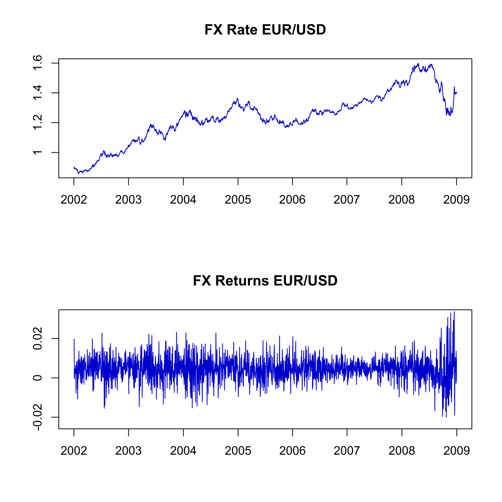

[](http://quantlet.de/index.php?p=info)

## [](http://quantlet.de/) **SPMfxrate** [](http://quantlet.de/d3/ia)

```yaml

Name of QuantLet : SPMfxrate

Published in : Nonparametric and Semiparametric Models

Description : Creates plots of EUR/USD rates and returns from 2002-01-01 to 2009-01-01.

Keywords : financial, returns, time-series, plot, graphical representation, data visualization

Author : Maria Osipenko, Awdesch Melzer

Submitted : Tue, October 23 2012 by Dedy Dwi Prastyo

Datafiles : exrate_GBR-USD_EUR-USD_20020101-20090101.txt

```




```r

# clear variables and close windows
rm(list = ls(all = TRUE))
graphics.off()

# load data
fx = read.table("exrate_GBR-USD_EUR-USD_20020101-20090101.txt")
n = nrow(fx)
returns = diff(log(as.matrix(fx[, 3])))  # Convert FX-rates to return series

par(mfrow = c(2, 1))

# Plot FX EUR/USD
plot(1:n, fx[, 3], type = "l", col = "blue3", ylab = "", xlab = "", axes = F, frame = T)
title("FX Rate EUR/USD")
axis(1, c(0, 261, 523, 784, 1044, 1304, 1566, 1828), c("2002", "2003", "2004", "2005", 
    "2006", "2007", "2008", "2009"))
axis(2, seq(0.8, 1.6, 0.2), round(seq(0.8, 1.6, 0.2), 2))

# Plot returns EUR/USD
plot(1:(n - 1), returns[, 1], type = "l", col = "blue3", ylab = "", xlab = "", axes = F, 
    frame = T, ylim = c(-0.028, 0.028))
title("FX Returns EUR/USD")
axis(1, c(0, 261, 523, 784, 1044, 1304, 1566, 1828), c("2002", "2003", "2004", "2005", 
    "2006", "2007", "2008", "2009"))
axis(2, seq(min(returns[, 1]), max(returns[, 1]), 0.02), round(seq(min(returns[, 1]), 
    max(returns[, 1]), 0.02), 2))
```
