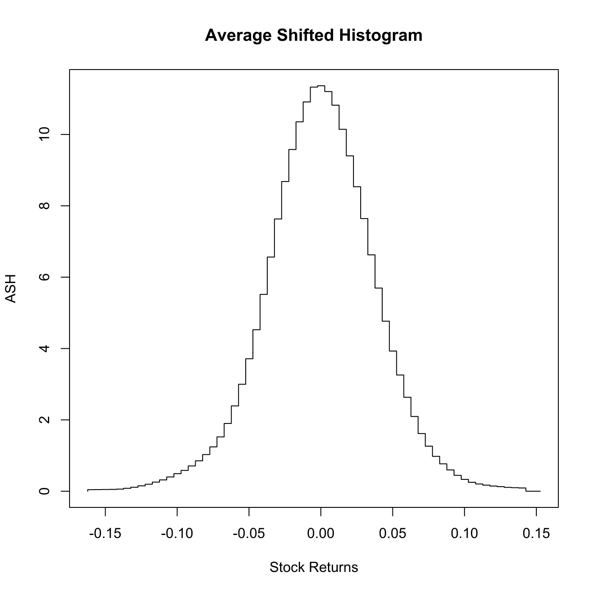

[](http://quantlet.de/index.php?p=info)

## [](http://quantlet.de/) **SPMashstock** [](http://quantlet.de/d3/ia)

```yaml

Name of QuantLet : SPMashstock

Published in : Nonparametric and Semiparametric Models

Description : Illustrates an averaged shifted histogram for stock returns.

Keywords : plot, graphical representation, data visualization, histogram, financial, returns, asset

See also : 'SPMstockreturnhisto, SPMhistogram, SPMhiststock, SPMbuffahisto, SPMHistoConstruct,
SPMhistobias2'

Author : Awdesch Melzer

Submitted : Mon, October 29 2012 by Dedy Dwi Prastyo

Datafiles : stockres.dat

```




```r

# clear variables and close windows
rm(list = ls(all = TRUE))
graphics.off()

# load data
x = read.table("stockres.dat")
x = as.matrix(x)

n = length(x)  # Number of observations.
step = 8  # Define the number of shifts.

t0 = NULL
tf = NULL

h = 0.04  # binwidth
t0 = h * (floor(min(x)/h) + 0.5)  # Min
tf = h * (floor(max(x)/h) - 0.5)  # Max

m = step
delta = h/m

nbin = floor((max(x) - min(x))/delta)
binedge = seq(min(x), max(x) + 0.01, delta)  # Define the bins of the histogram

vk = hist(x, binedge, plot = FALSE)$counts  # Count the number of elements in each bin
fhat = c(rep(0, m - 1), vk, rep(0, m - 1))

kern = function(s) 1 - abs(s)
ind = (1 - m):(m - 1)
den = sum(kern(ind/m))
wm = m * (kern(ind/m))/den

fhatk = matrix(0, 0, n + 1)

for (k in 1:nbin) {
    ind = k:(2 * m + k - 2)
    fhatk[k] = sum(wm * fhat[ind])
}

fhatk = fhatk/(n * h)
binedge = c(rep(min(binedge), 1), binedge)
fhatk = c(rep(0, 1), fhatk, rep(0, 3))

# Plot ash
plot(binedge, fhatk, type = "s", main = "Average Shifted Histogram", xlab = "Stock Returns", 
    ylab = "ASH")


```
