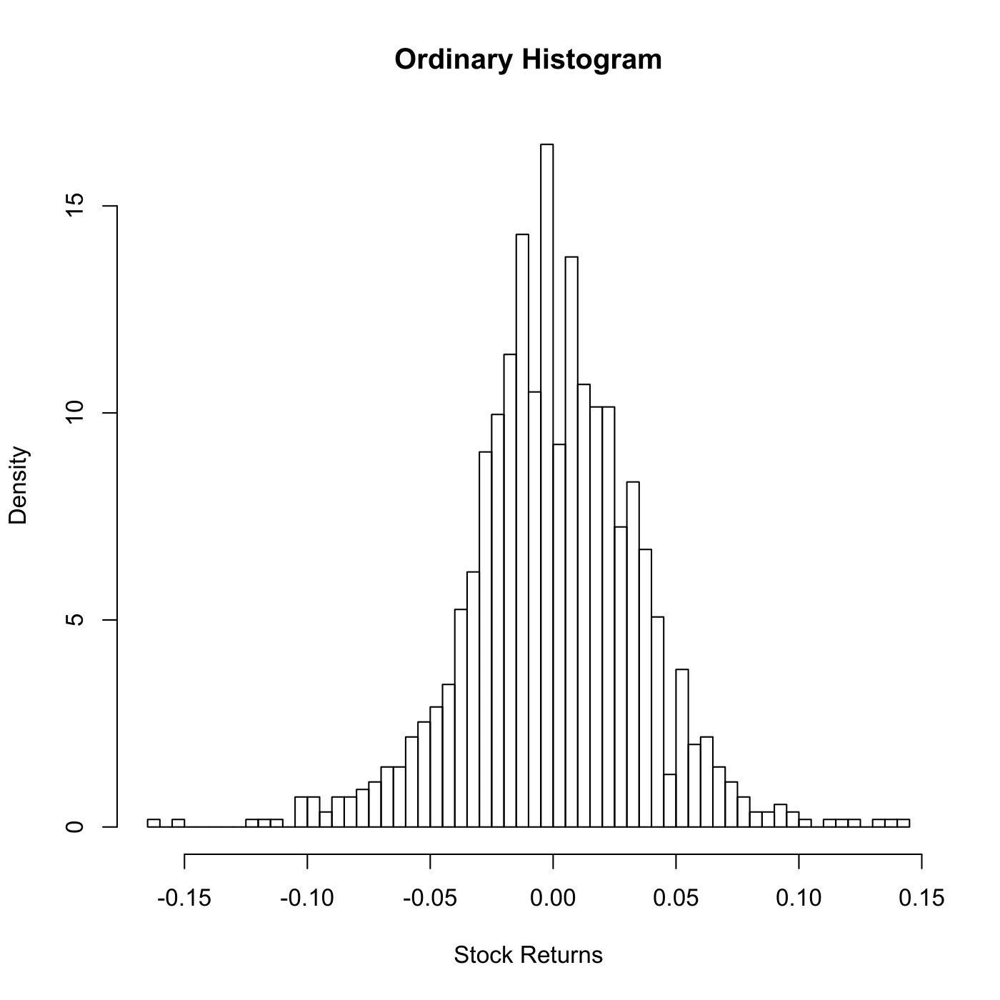

[](http://quantlet.de/index.php?p=info)

## [](http://quantlet.de/) **SPMhiststock** [](http://quantlet.de/d3/ia)

```yaml

Name of QuantLet : SPMhiststock

Published in : Nonparametric and Semiparametric Models

Description : Illustrates an ordinary histogram for stock returns.

Keywords : plot, graphical representation, data visualization, histogram, financial, returns, asset

See also : 'SPMstockreturnhisto, SPMhistogram, SPMashstock, SPMbuffahisto, SPMHistoConstruct,
SPMhistobias2'

Author : Awdesch Melzer

Submitted : Mon, October 29 2012 by Dedy Dwi Prastyo

Datafiles : stockres.dat

```




```r

# clear variables and close windows
rm(list = ls(all = TRUE))
graphics.off()

# load data
x = read.table("stockres.dat")
h = 0.005  # bandwidth
grid = seq(round(min(x), 3) - 0.003, round(max(x), 3) + h, h)  # grid points

# plot histogram
hist(as.matrix(x), grid, probability = T, xlab = "Stock Returns", main = "Ordinary Histogram")

```
