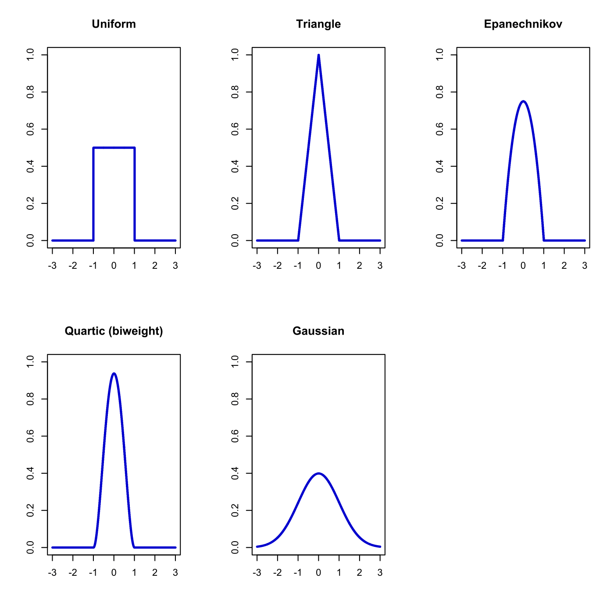

[](http://quantlet.de/index.php?p=info)

## [](http://quantlet.de/) **SPMkernel** [](http://quantlet.de/d3/ia)

```yaml

Name of QuantLet : SPMkernel

Published in : Nonparametric and Semiparametric Models

Description : 'Plots different kernel functions: uniform, triangle, epanechnikov, quartic,
gaussian.'

Keywords : 'kernel, uniform, Epanechnikov, quartic, gaussian, plot, graphical representation, data
visualization'

See also : SPMkernelregression, SPMsplinekernel, SPMkernelcontours

Author : Andrija Mihoci, Awdesch Melzer, Dedy D. Prastyo

Submitted : Thu, November 15 2012 by Dedy Dwi Prastyo

```




```r

# clear variables and close windows
rm(list = ls(all = TRUE))
graphics.off()

# Different Kernel Functions
u = seq(-3, 3, 0.01)
K_Uniform      = 0.5 * (abs(u) <= 1)                   # kernel of uniform distribution
K_Triangle     = (1 - abs(u)) * (abs(u) <= 1)          # kernel of triangle distribution
K_Epanechnikov = 0.75 * (1 - u^2) * (abs(u) <= 1)      # epanechnikov kernel
K_Quartic      = 0.9375 * (1 - u^2)^2 * (abs(u) <= 1)  # kernel of quadratic biweighted distribution
K_Gaussian     = 0.3989 * exp(-0.5 * u^2)              # kernel of a gaussian distribution

# Plot Kernels
par(mfrow = c(2, 3))
plot(u, K_Uniform, type = "s", col = "blue3", ylim = c(0, 1), ylab = "", xlab = "", 
    lwd = 2.5)
title("Uniform")
plot(u, K_Triangle, type = "s", col = "blue3", ylim = c(0, 1), ylab = "", xlab = "", 
    lwd = 2.5)
title("Triangle")
plot(u, K_Epanechnikov, type = "s", col = "blue3", ylim = c(0, 1), ylab = "", xlab = "", 
    lwd = 2.5)
title("Epanechnikov")
plot(u, K_Quartic, type = "s", col = "blue3", ylim = c(0, 1), ylab = "", xlab = "", 
    lwd = 2.5)
title("Quartic (biweight)")
plot(u, K_Gaussian, type = "s", col = "blue3", ylim = c(0, 1), ylab = "", xlab = "", 
    lwd = 2.5)
title("Gaussian")


```
