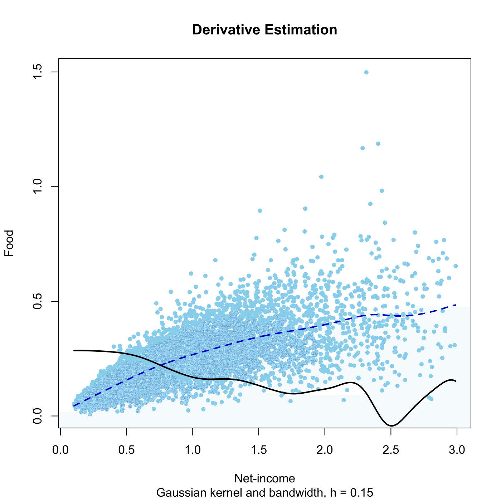

[](http://quantlet.de/index.php?p=info)

## [](http://quantlet.de/) **SPMderivest** [](http://quantlet.de/d3/ia)

```yaml

Name of QuantLet : SPMderivest

Published in : Nonparametric and Semiparametric Models

Description : Computes a derivative estimator for UK 1973 expenditure data.

Keywords : estimation, derivative, financial, plot, graphical representation, data visualization

See also : SPMlocpolyest, SPMnadwaest

Author : Awdesch Melzer

Submitted : Wed, December 19 2012 by Dedy Dwi Prastyo

Datafiles : agg73sh.dat

```




```r

# clear variables and close windows
rm(list = ls(all = TRUE))
graphics.off()

# install and load packages
libraries = c("KernSmooth")
lapply(libraries, function(x) if (!(x %in% installed.packages())) {
install.packages(x)
})
lapply(libraries, library, quietly = TRUE, character.only = TRUE)

# load data
x = read.table("agg73sh.dat")
x = cbind(x[, 1], x[, 4])  # select income and food expenditures
h = 0.15  # bandwidth

# local polynomial regression
mh = locpoly(x[, 1], x[, 2], drv = 0L, degree = 1L, kernel = "normal", bandwidth = h)
md = locpoly(x[, 1], x[, 2], drv = 1, degree = 1L, kernel = "normal", bandwidth = h)

# plot
plot(x, type = "n", main = "Derivative Estimation", xlab = "Net-income", ylab = "Food", 
    sub = paste("Gaussian kernel and bandwidth, h =", h))
points(x, col = "skyblue", pch = 20)
lines(mh, lwd = 2, col = "blue3", lty = "dashed")
lines(md, lwd = 2, col = "black")

```
