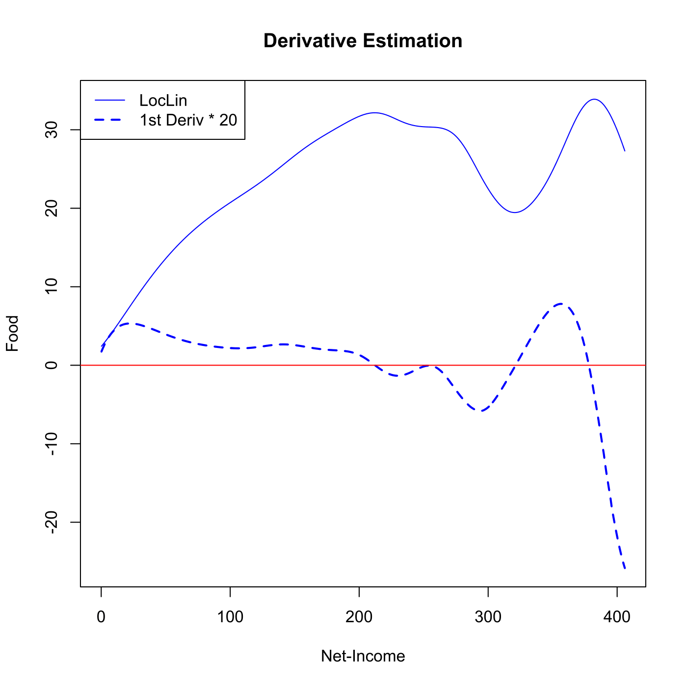

[](http://quantlet.de/index.php?p=info)

## [](http://quantlet.de/) **SPMlocpolyderivative** [](http://quantlet.de/d3/ia)

```yaml

Name of QuantLet : SPMlocpolyderivative

Published in : Nonparametric and Semiparametric Models

Description : 'Computes the derivative of the food on net-income regression for the UK 1976
expenditure data using local polynomials.'

Keywords : 'derivative, kernel, local polynomial, nonparametric, regression, financial, plot,
graphical representation, data visualization'

See also : SPMlocpolyregression, SPMlocpolyest

Author : Marlene Mueller

Submitted : Wed, January 16 2013 by Awdesch Melzer

Datafiles : fes76.txt

```




```r

# clear variables and close windows
rm(list = ls(all = TRUE))
graphics.off()

# install and load packages
libraries = c("KernSmooth")
lapply(libraries, function(x) if (!(x %in% installed.packages())) {
install.packages(x)
})
lapply(libraries, library, quietly = TRUE, character.only = TRUE)

# load data
x = read.csv("fes76.txt", sep = ";", dec = ".")
x = x[, c("NIC", "FOO")]
x = x[order(x$NIC), ]

mh1 = locpoly(x$NIC, x$FOO, degree = 1, kernel = "normal", bandwidth = 20)  # Estimate regression function using local polynomials.
mh2.1 = locpoly(x$NIC, x$FOO, drv = 1, degree = 2, kernel = "normal", bandwidth = 20)  # Determine first order derivative.

# plot
fac = 20  # Multiplication factor for first order derivative - for representation purposes.
ylim = range(c(mh1$y, fac * mh2.1$y))
plot(mh1, col = "blue", type = "l", ylim = ylim, main = "Derivative Estimation", xlab = "Net-Income", 
    ylab = "Food")
lines(mh2.1$x, fac * mh2.1$y, col = "blue", lwd = 2, lty = 2)
abline(a = 0, b = 0, col = "red")
legend("topleft", c("LocLin", paste("1st Deriv *", fac)), col = "blue", lwd = c(1, 
    2), lty = c(1, 2))

```
