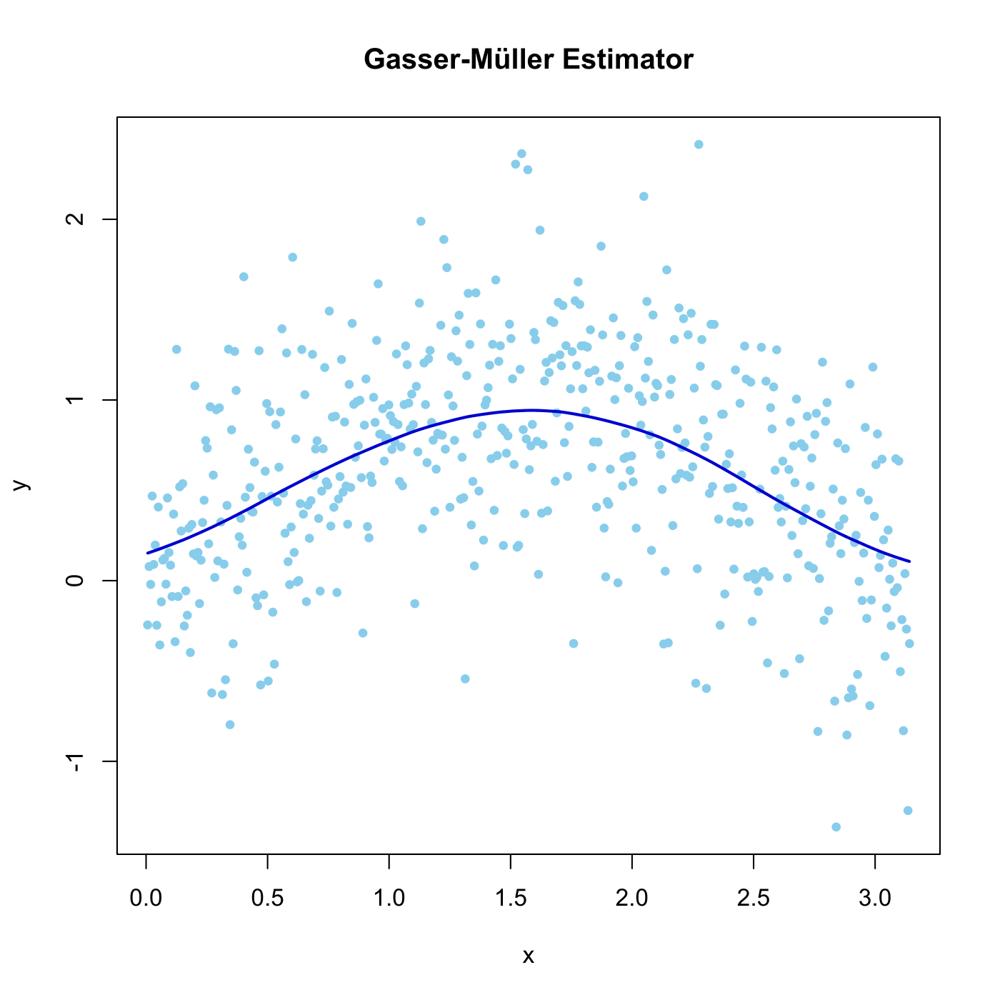
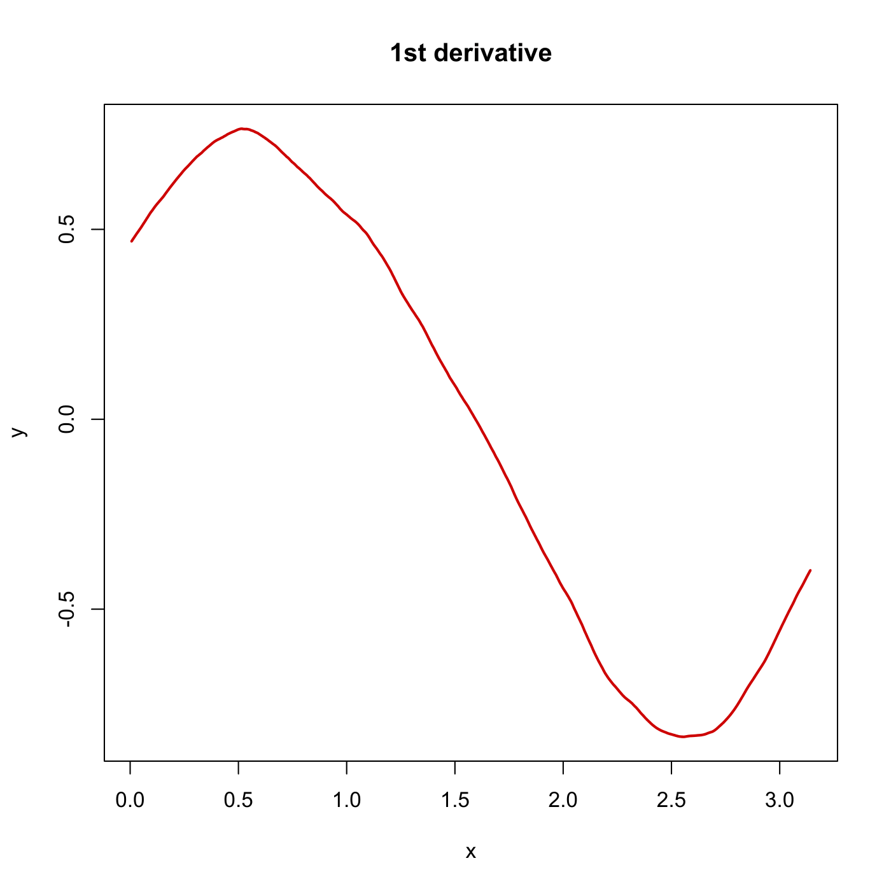

[](http://quantlet.de/index.php?p=info)

## [](http://quantlet.de/) **SPMgasmul** [](http://quantlet.de/d3/ia)

```yaml

Name of QuantLet : SPMgasmul

Published in : Nonparametric and Semiparametric Models

Description : Shows the Gasser-Mueller estimator and its first derivative for simulated data set.

Keywords : derivative, nonparametric, estimation, simulation, plot, graphical representation

See also : SPMderivest, SPMlocpolyderivative

Author : Awdesch Melzer

Submitted : Wed, January 16 2013 by Maria Osipenko

```






```r

# clear variables and close windows
rm(list = ls(all = TRUE))
graphics.off()

# Gasser Mueller Smoothing Method (fixed design)
kernel = function(time, x, h, fun) {
	
    # Weights functions
    uni = function(time, avg_t, h) {
        # Uniform function
        m = length(avg_t)
        s = 0.5 * (avg_t[2:m] - avg_t[1:(m - 1)])/h
        s = s * (abs((avg_t[2:m] - time)/h) <= 1)
        return(s)
    }
    
    qua = function(time, avg_t, h) {
        # Quadratic weight function
        r = (time - avg_t)/h
        m = length(r)
        m1 = length(avg_t)
        s = ((3 * r[1:(m - 1)] - r[1:(m - 1)]^3) - (3 * r[2:m] - r[2:m]^3))/4
        s = s * (abs((avg_t[2:m1] - time)/h) <= 1)
        return(s)
    }
    
    fde = function(time, avg_t, h) {
        # Weights for the estimation the first derivative
        
        r = (time - avg_t)/h
        m = length(r)
        s = (15 * ((r[1:(m - 1)]^4 - 2 * r[1:(m - 1)]^2) - (r[2:m]^4 - 2 * r[2:m]^2)))/(16 * 
            h)
        m1 = length(avg_t)
        s = s * (abs((avg_t[2:m1] - time)/h) <= 1)
        return(s)
    }
    
    sde = function(time, avg_t, h) {
        # Weights for the estimation of the second derivative.
        r = (time - avg_t)/h
        m = length(r)
        s = (105 * ((2 * r[1:(m - 1)]^3 - r[1:(m - 1)]^5 - r[1:(m - 1)]) - (2 * r[2:m]^3 - 
            r[2:m]^5 - r[2:m])))/(16 * h^2)
        m1 = length(avg_t)
        s = s * (abs((avg_t[2:m1] - t)/h) <= 1)
        return(s)
    }
    smooth_d = numeric()
    S = numeric()
    
    if (missing(h)) {
        stop("bandwidth missing")
    }
    if (missing(time)) {
        stop("input sample interval matrix (n x 2)")
    }
    if (missing(x)) {
        stop("input data matrix (n x 2)")
    }
    if (missing(fun)) {
        fun = "qua"  # Default weight function: Quadratic.   
    }
    time = as.matrix(time)
    rown = nrow(x)
    column = ncol(x)
    trown = nrow(time)
    tcolumn = ncol(time)
    
    if (nrow(x) != nrow(time)) {
        stop("Number of sample intervals and number of data should be the same!")
    }
    if (h <= 0) {
        stop("Bandwidth h must be a positive value!")
    }
    
    # Kernel Smoothing
    avg_t = numeric()
    avg_t[1] = time[1]  # average of x with its neighborhood, avg_t[0]=x[1]
    avg_t[nrow(time) + 1] = time[trown]  # avg_t[n]=x[n]
    for (i in 2:length(time)) {
        avg_t[i] = (time[i] + time[i - 1])/2
    }
    doit = function(f, ...) {
        f(...)
    }
    for (i in 1:length(time)) {
        if (fun == "uni") {
            S = doit(uni, time[i], avg_t, h)
            smooth_d[i] = S %*% x
        } else if (fun == "qua") {
            S = doit(qua, time[i], avg_t, h)
            smooth_d[i] = S %*% x
        } else if (fun == "fde") {
            S = doit(fde, time[i], avg_t, h)
            smooth_d[i] = S %*% x
        } else if (fun == "sde") {
            S = doit(sde, time[i], avg_t, h)
            smooth_d[i] = S %*% x
        }
    }
    return(smooth_d)
}

# main computation
pts = 500  # number of observation
set.seed(100)  # pseudo random numbers
x = pi * ((1:pts)/pts)  # interval
y = (sin(x) + 0.5 * rnorm(pts))  # simulation
h = 0.8  # bandwidth

GMqua = kernel(x, as.matrix(y), h, "qua")  # Gasser-Müller Smoother
GMfde = kernel(x, as.matrix(y), h, "fde")  # Gasser-Müller 1st derivative

# plot
plot(x, y, type = "n", col = "skyblue", pch = 19)
title("Gasser-Müller Estimator")
points(x, y, col = "skyblue", pch = 19, cex = 0.7)
lines(x, GMqua, lwd = 2, col = "blue3")

# plot
dev.new()
plot(x, y, type = "n", col = "skyblue", pch = 19, ylim = c(min(GMfde), max(GMfde)))
title("1st derivative")
lines(x, GMfde, lwd = 2, col = "red3")


```
