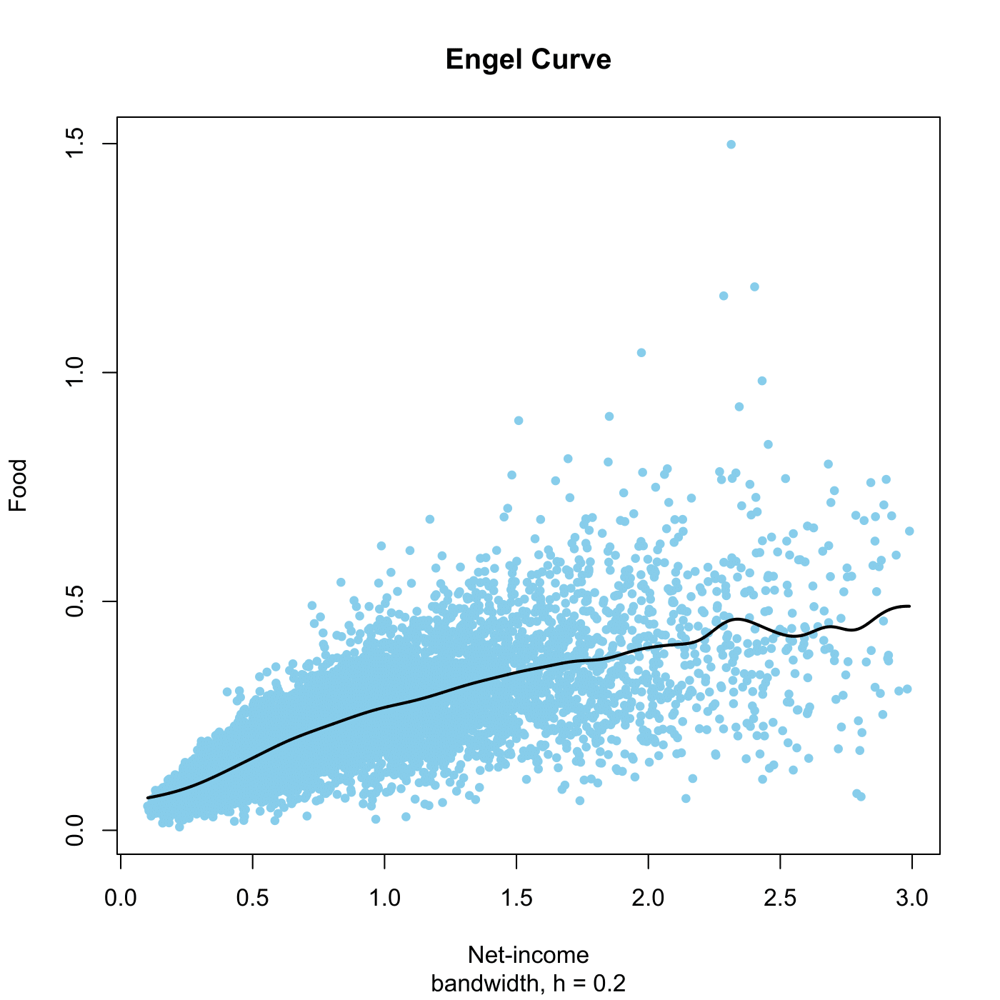

[](http://quantlet.de/index.php?p=info)

## [](http://quantlet.de/) **SPMengelcurve1** [](http://quantlet.de/d3/ia)

```yaml

Name of QuantLet : SPMengelcurve1

Published in : Nonparametric and Semiparametric Models

Description : Computes the regression of food on net-income for the UK 1973 expenditure data.

Keywords : nonparametric, regression, plot, graphical representation, data visualization

See also : SPMengelcurve, SPMengelconf, SPMengelconfsample, SPMspline, SPMsplineregression

Author : Awdesch Melzer

Submitted : Wed, January 16 2013 by Maria Osipenko

Datafiles : agg73sh.dat

```




```r

# clear variables and close windows
rm(list = ls(all = TRUE))
graphics.off()

# load data
data = read.table("agg73sh.dat")
x = data[, 1]
y = data[, 4]
h = 0.2
mh = ksmooth(x, y, kernel = "normal", bandwidth = h)

# plot
plot(x, y, type = "n", ylab = "Food", xlab = "Net-income", sub = paste("bandwidth, h =", 
    h))
title("Engel Curve")
points(x, y, pch = 19, col = "skyblue", cex = 0.7)
lines(mh, lwd = 2)

```
