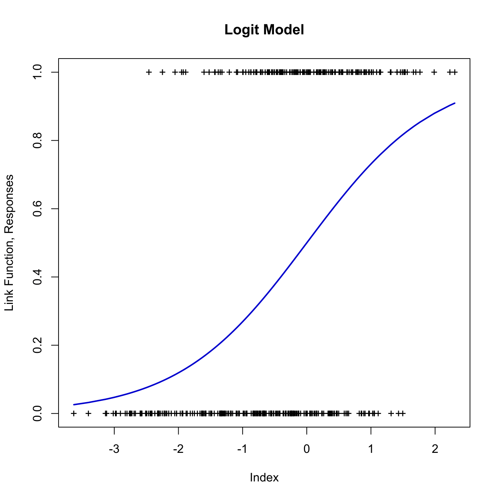

[](http://quantlet.de/index.php?p=info)

## [](http://quantlet.de/) **SPMlogit** [](http://quantlet.de/d3/ia)

```yaml

Name of QuantLet : SPMlogit

Published in : Nonparametric and Semiparametric Models

Description : Estimates a logit model for migration data from Mecklenburg-Vorpommern, GSOEP 1991.

Keywords : estimation, logit, plot, graphical representation, data visualization

See also : SPMmigmvdesc, SPM2density2D, SPMcontour2D

Author : Awdesch Melzer

Submitted : Wed, March 20 2013 by Franziska Schulz

Datafiles : migmv.dat

```




```r

# clear variables and close windows
rm(list = ls(all = TRUE))
graphics.off()

# install and load packages
libraries = c("VGAM")
lapply(libraries, function(x) if (!(x %in% installed.packages())) {
install.packages(x)
})
lapply(libraries, library, quietly = TRUE, character.only = TRUE)

# summarize subroutine
summarize = function(x) {
    Minimum = apply(x, 2, min)
    Maximum = apply(x, 2, max)
    Mean = apply(x, 2, mean)
    Median = apply(x, 2, median)
    Std.Error = apply(x, 2, sd)
    table = cbind(Minimum, Maximum, Mean, Median, Std.Error)
    return(table = table)
}

# load data
x = read.table("migmv.dat")
y = x[, 1]
x = cbind(matrix(1, nrow(x), 1), x[, 2:ncol(x)])
colnames(x) = c("const", "age", "famfr", "unemp", "city", "female", "income")
summarize(x)

x = data.frame(x)
l = glm(y ~ factor(x$famfr) + factor(x$unemp) + factor(x$city) + factor(x$female) + 
    x$age + x$income, family = binomial(link = "logit"))  # estimate model

b = as.matrix(l$coefficients)  # estimated coefficients
b = cbind(c(b[1], b[6], b[2], b[3], b[4], b[5], b[7]))  # reorder according to x
eta = as.matrix(x) %*% b  # estimate eta, the canonical link

glmlink = function(eta) {
    # link function
    e = exp(eta)
    mu = e/(1 + e)
    mu = mu + 1e-16 * (mu == 0) - 1e-16 * (mu == 1)
}

link = glmlink(eta)  # compute link funtion for eta
link = cbind(eta, link)
link = link[order(link[, 1]), ]  # order

# Plot 
plot(eta, y, pch = "+", xlab = "Index", ylab = "Link Function, Responses")
title("Logit Model")
lines(link, lwd = 2, col = "blue3")

```
