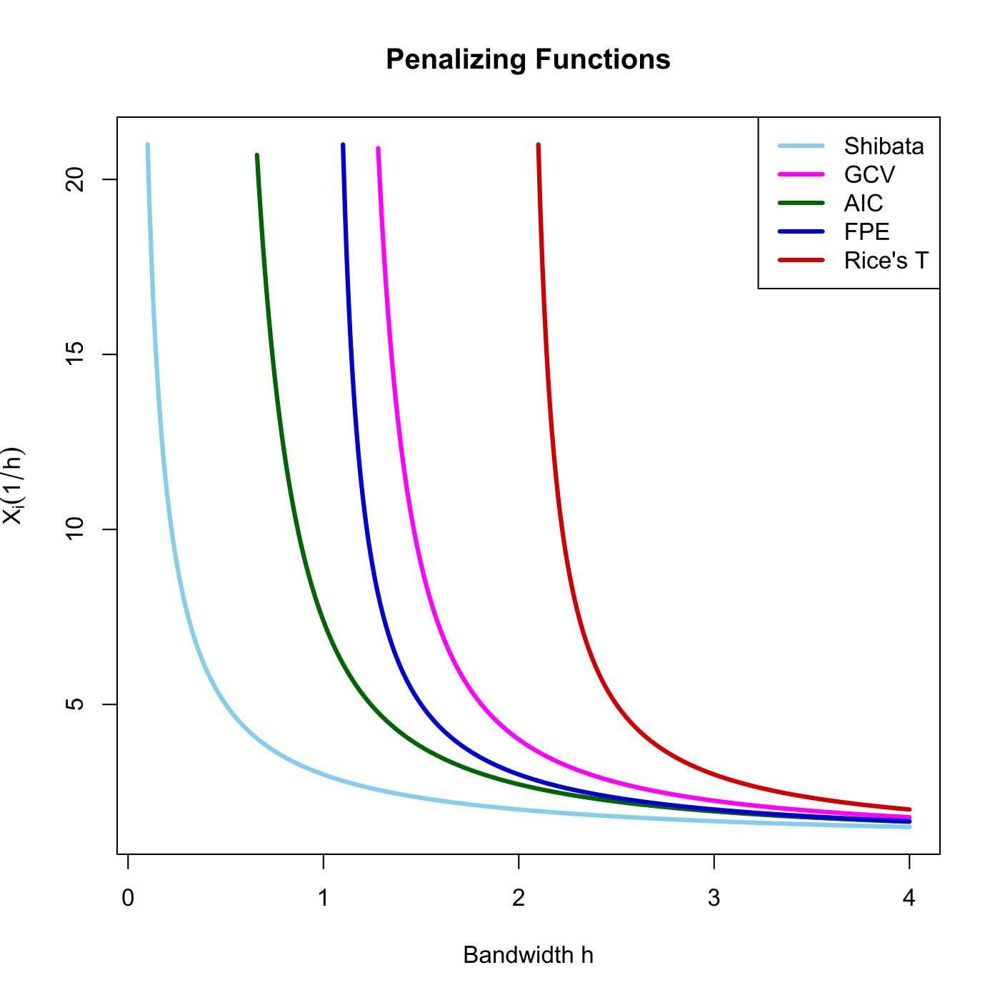

[](http://quantlet.de/index.php?p=info)

## [](http://quantlet.de/) **SPMpenalize** [](http://quantlet.de/d3/ia)

```yaml

Name of QuantLet : SPMpenalize

Published in : Nonparametric and Semiparametric Models

Description : 'Displays different penalizing function: S, AIC, FPE, GCV, T.'

Keywords : AIC, plot, graphical representation

Author : Awdesch Melzer

Submitted : Wed, March 20 2013 by Franziska Schulz

```




```r

# clear variables and close windows
rm(list = ls(all = TRUE))
graphics.off()

h = seq(0, by = 0.01, length = 401)

pshi = cbind(h, (1 + 2/h))
pgcv = cbind(h, (1/((1 - 1/h)^2)))
paic = cbind(h, (exp(2/h)))
pfpe = cbind(h, ((1 + 1/h)/(1 - 1/h)))
pric = cbind(h, (1/(1 - 2/h)))

pshi = pshi[which((pshi[, 1] >= 0) & (pshi[, 2] <= 21)), ]
pgcv = pgcv[which((h >= 1) & (pgcv[, 2] <= 21)), ]
paic = paic[which((h >= 0) & (paic[, 2] <= 21)), ]
pfpe = pfpe[which((h >= 1) & (pfpe[, 2] <= 21)), ]
pric = pric[which((h >= 2) & (pric[, 2] <= 21)), ]

# plot
plot(pshi, type = "l", col = "skyblue", xlab = "Bandwidth h", ylab = expression(X[i](1/h)), 
    lwd = 3, main = "Penalizing Functions")
lines(pgcv, type = "l", col = "magenta", lwd = 3)
lines(paic, type = "l", col = "darkgreen", lwd = 3)
lines(pfpe, type = "l", col = "blue3", lwd = 3)
lines(pric, type = "l", col = "red3", lwd = 3)
legend("topright", c("Shibata", "GCV", "AIC", "FPE", "Rice's T"), col = c("skyblue", 
    "magenta", "darkgreen", "blue3", "red3"), lty = c(1, 1, 1, 1, 1), lwd = c(3, 3, 
    3, 3, 3))
```
