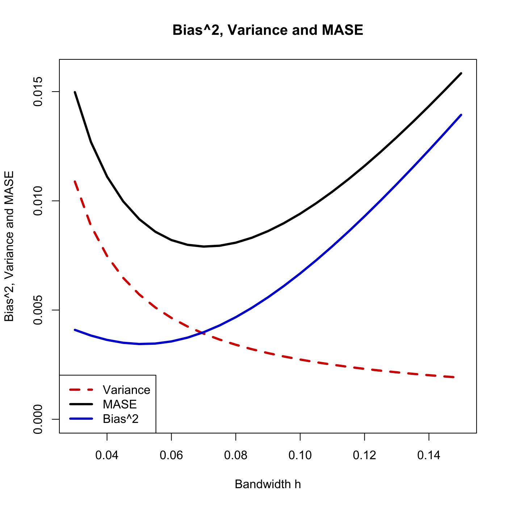
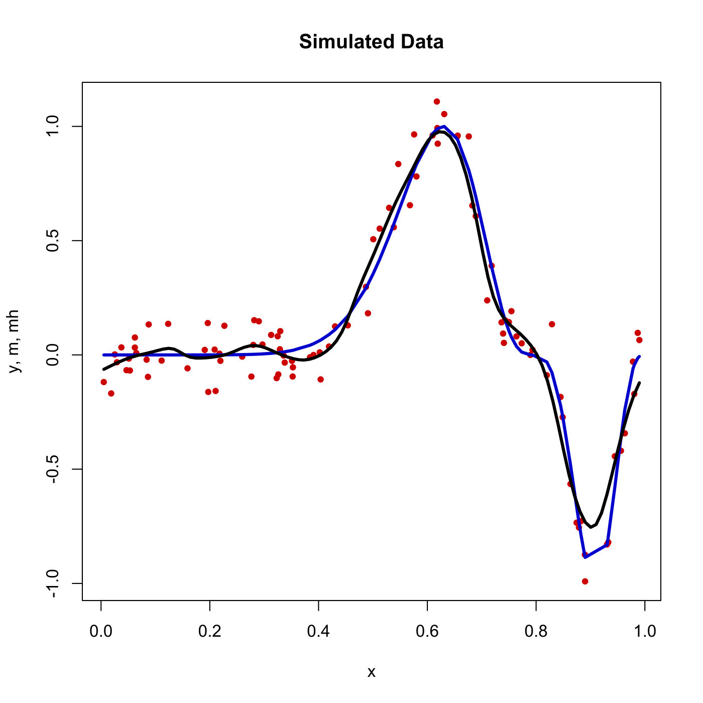

[](http://quantlet.de/index.php?p=info)

## [](http://quantlet.de/) **SPMsimulmase** [](http://quantlet.de/d3/ia)

```yaml

Name of QuantLet : SPMsimulmase

Published in : Nonparametric and Semiparametric Models

Description : 'Visualizes bias^2, variance and mean averaged squared error (MASE) for the
regression of simulated data.'

Keywords : plot, graphical representation, bias, variance, regression, simulation, mase

See also : SPMkdemse

Author : Awdesch Melzer

Submitted : Wed, March 20 2013 by Franziska Schulz

```






```r

# clear variables and close windows
rm(list = ls(all = TRUE))
graphics.off()

# install and load packages
libraries = c("locpol")
lapply(libraries, function(x) if (!(x %in% installed.packages())) {
install.packages(x)
})
lapply(libraries, library, quietly = TRUE, character.only = TRUE)

# parameter settings
set.seed(20130318)
n = 100  # number of observations
x = runif(n)  # uniform sample
s = sqrt(0.01)
e = rnorm(n) * s  # error
m = (sin(2 * pi * (x^3)))^3  # true line
y = m + e

tmp = cbind(x, y, m)
tmp = tmp[order(tmp[, 1]), ]
x   = tmp[, 1]
y   = tmp[, 2]
m   = tmp[, 3]
ng  = 25
h   = seq(0.03, by = (0.15 - 0.03)/(ng - 1), length = ng)

snorm = function(u) {
    k = dnorm(u)
    # k = (1-u^2)^2 * (abs(u)<=1) # Quartic Kernel ignored
    return(k)
}

# routine mbv computes MASE, variance and bias^2 for given data sample and a range
# of bandwidths
mbv = function(x, h, m, s) {
    x    = as.matrix(x)
    h    = as.matrix(h)
    m    = as.matrix(m)
    nh   = nrow(h)
    n    = nrow(x)
    mase = matrix(0, nh, 1)
    b2   = mase
    v    = mase
    w    = (abs(x - 0.5) <= 0.45)
    k    = 0
    while (k < nh) {
        k = k + 1
        print(paste("h[", k, "]=", h[k]))
        tmp1    = PRDenEstC(x, xeval = seq(min(x), max(x), length = length(x)), bw = h[k], 
            kernel = gaussK)$den
        tmp     = ksmooth(x = x, y = m, bandwidth = h[k], kernel = "normal")
        mhh     = tmp$y
        b2[k]   = sum(w * (mhh - m)^2)/n  # bias squared
        mhh     = apply(s * (snorm((matrix(x, nrow(x), nrow(x), byrow = F) - matrix(x, 
            nrow(x), nrow(x), byrow = T))/h[k])/h[k])^2, 2, sum)/(n^2)
        v[k]    = sum(w * ((matrix(mhh))/(tmp1^2)))/n  # variance
        mase[k] = b2[k] + v[k]  # MASE
    }
    return(list(mase = mase, b2 = b2, v = v))
}

ase  = mbv(x, h, m, s)
mase = ase$mase
b2   = ase$b2
v    = ase$v

# plot
plot(h, v, type = "l", lwd = 3, lty = 2, col = "red3", xlab = "Bandwidth h", ylab = "Bias^2, Variance and MASE", 
    ylim = c(0, max(mase)))
title("Bias^2, Variance and MASE")
lines(h, mase, lwd = 3, col = "black")
lines(h, b2, lwd = 3, col = "blue3")
legend("bottomleft", c("Variance", "MASE", "Bias^2"), lty = c(2, 1, 1), lwd = c(3, 
    3, 3), col = c("red3", "black", "blue3"))

# plot
tmp = cbind(h, mase)
(hopt = subset(tmp, tmp[, 2] == min(tmp[, 2])))
mh = ksmooth(x, y, kernel = "normal", bandwidth = hopt)
dev.new()
plot(x, y, type = "n", ylab = "y, m, mh", xlab = "x")
title("Simulated Data")
points(x, y, pch = 19, col = "red3", cex = 0.7)
lines(x, m, col = "blue3", lwd = 3)
lines(mh, lwd = 3)


```
