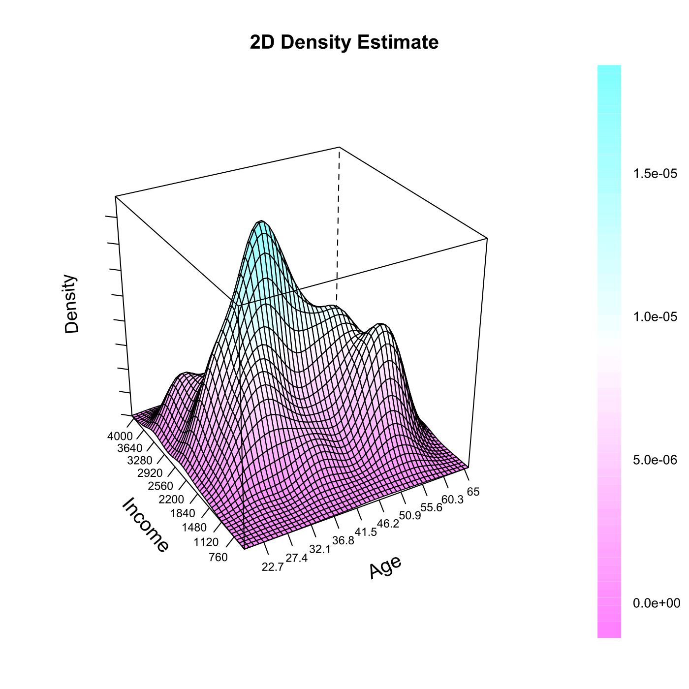

[](http://quantlet.de/index.php?p=info)

## [](http://quantlet.de/) **SPM2density2D** [](http://quantlet.de/d3/ia)

```yaml

Name of QuantLet : SPM2density2D

Published in : Nonparametric and Semiparametric Models

Description : 'Estimates a bivariate kernel density for age and income of migration data from
Mecklenburg-Vorpommern, GSOEP 1991. The density estimate is plotted in the 3D space.'

Keywords : '3D, bivariate, density, estimation, kernel, plot, graphical representation, data
visualization'

See also : SPMcontour2D, SPMlogit, SPMmigmvdesc

Author : Awdesch Melzer

Submitted : Fri, June 14 2013 by Awdesch Melzer

Datafiles : migmv.dat

```




```r

# clear variables and close windows
rm(list = ls(all = TRUE))
graphics.off()

# install and load packages
libraries = c("KernSmooth", "lattice")
lapply(libraries, function(x) if (!(x %in% installed.packages())) {
install.packages(x)
})
lapply(libraries, library, quietly = TRUE, character.only = TRUE)

# load data
x = read.table("migmv.dat")
x = x[, c(2, 7)]  # select Age and Income
n = nrow(x)  # number of observations

h = 1.06 * c(sd(x[, 1]), sd(x[, 2])) * length(x[, 1])^(-1/5)  # rule-of-thumb bandwidth's

# density estimate
fh = bkde2D(x, bandwidth = h)$fhat

# plot
par.set = list(axis.line = list(col = "transparent"), clip = list(panel = "off"))
wireframe(fh, drape = T, colorkey = T, ticktype = "detailed", main = paste("2D Density Estimate"), 
    screen = list(z = 30, x = -60), scales = list(arrows = FALSE, col = "black", distance = 1, 
        tick.number = 8, cex = 0.7, x = list(labels = round(seq(min(x[, 1]), max(x[, 
            1]), length = 11), 1)), y = list(labels = round(seq(min(x[, 2]), max(x[, 
            2]), length = 11), 1)), z = list(labels = rep("", 11))), xlab = list("Age", 
        rot = 25, cex = 1.2), ylab = list("Income", rot = -50, cex = 1.2), zlab = list("Density", 
        rot = 95, cex = 1.1), par.settings = par.set)

```
