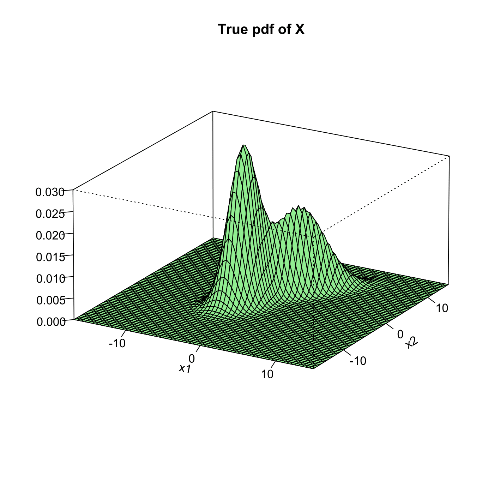
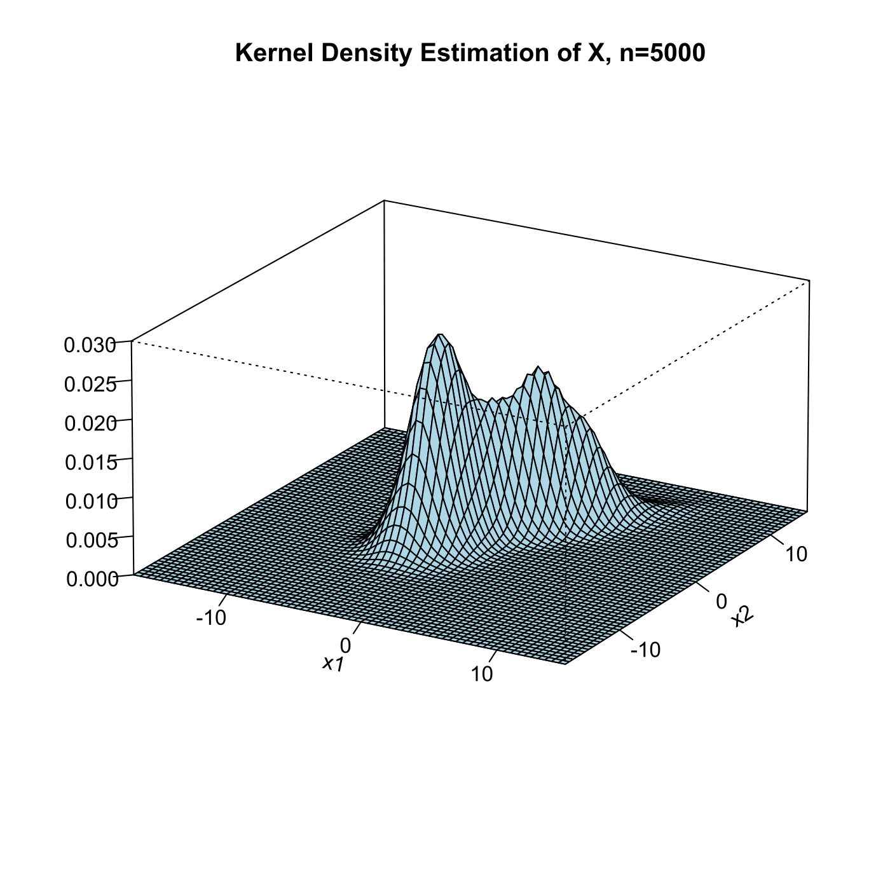

[](http://quantlet.de/index.php?p=info)

## [](http://quantlet.de/) **SPMkde2D** [](http://quantlet.de/d3/ia)

```yaml

Name of QuantLet : SPMkde2D

Published in : Nonparametric and Semiparametric Models

Description : 'Computes the kernel density estimate for simulated multivariate normal random
numbers.'

Keywords : 'plot, graphical representation, kernel, density, kde, bivariate, multivariate,
estimation, simulation, normal, random'

See also : SPMkdemse, SPMkdebias_sim, SPMkdebias, SPMkdeconstruct, SPMkdeconstruct-Sliders

Author : Anna Wieber

Submitted : Fri, June 14 2013 by Awdesch Melzer

Code warning : 'In persp.default(x1, x2, z1, main = "True pdf of X", col = "lightgreen", : surface
extends beyond the box'

```






```r

# clear variables and close windows
rm(list = ls(all = TRUE))
graphics.off()

# install and load packages
libraries = c("mnormt", "KernSmooth", "MASS")
lapply(libraries, function(x) if (!(x %in% installed.packages())) {
install.packages(x)
})
lapply(libraries, library, quietly = TRUE, character.only = TRUE)

# define axis
x1 = seq(-17, 15, length = 65)
x2 = x1

# Defintion of the distribution parameters 
# 1. bivariate normal density 
mu1 = c(1, 4)
sigma1 = matrix(c(5, 5, 5, 7), 2, 2)

# 2. bivariate normal density 
mu2 = c(-3, -2)
sigma2 = matrix(c(2, 0.7, 0.7, 4), 2, 2)

# 3. bivariate normal density
mu3 = c(-10, -6)
sigma3 = matrix(c(6, 6, 6, 7), 2, 2)

# generate bivariate multimodal pdfs 
f1 = function(x1, x2) {
    0.4 * dmnorm(cbind(x1, x2), mu1, sigma1) + 0.6 * dmnorm(cbind(x1, x2), mu2, sigma2)
}
z1 = outer(x1, x2, f1)

f2 = function(x1, x2) {
    0.5 * dmnorm(cbind(x1, x2), mu1, sigma1) + 0.5 * dmnorm(cbind(x1, x2), mu3, sigma3)
}
z2 = outer(x1, x2, f2)

# Simulate Data for the 3 bivariate pdfs
n1 = 5000
n2 = 50000

# first bivarite normal with different n
s1n1 = rmnorm(n1, mu1, sigma1)
s1n2 = rmnorm(n2, mu1, sigma1)

# second bivarite normal with different n 
s2n1 = rmnorm(n1, mu2, sigma2)
s2n2 = rmnorm(n2, mu2, sigma2)

# third bivarite normal with different n
s3n1 = rmnorm(n1, mu3, sigma3)
s3n2 = rmnorm(n2, mu3, sigma3)

# pull from distribution via bernoulli 
binn1 = rbinom(n1, size = 1, prob = 0.5)
binn2 = rbinom(n2, size = 1, prob = 0.5)

bin2n1 = rbinom(n1, size = 1, prob = 0.4)
bin2n2 = rbinom(n2, size = 1, prob = 0.4)

# first biv. mixture density with different n 
y1n1 = binn1 * s1n1 + (1 - binn1) * s2n1
y1n2 = binn2 * s1n2 + (1 - binn2) * s2n2

# second biv. mixture density with different n
y2n1 = bin2n1 * s1n1 + (1 - bin2n1) * s3n1
y2n2 = bin2n2 * s1n2 + (1 - bin2n2) * s3n2

# Use General Matrix rule of thumb to calc. Bandwidth Matrix 
# Estimate squareroot of VCV-Matrix for 1st distribution
sig1n1 = sqrt(var(y1n1))
sig1n2 = sqrt(var(y1n2))

# Estimate squareroot of VCV-Matrix for 2nd distribution 
sig2n1 = sqrt(var(y2n1))
sig2n2 = sqrt(var(y2n2))

# Calculate H for 1st distr.
h1n1 = n1^(-1/6) * sig1n1
h1n2 = n2^(-1/6) * sig1n2

# Calculate H for 2nd distr. 
h2n1 = n1^(-1/6) * sig2n1
h2n2 = n2^(-1/6) * sig2n2

# Calculate Kernel Densities 
# 1st Mixture Density 
kd1n1 = bkde2D(y1n1, bandwidth = (h1n1), gridsize = c(65, 65), range.x = list(c(-17, 
    15), c(-17, 15)))
kd1n2 = bkde2D(y1n2, bandwidth = (h1n2), gridsize = c(65, 65), range.x = list(c(-17, 
    15), c(-17, 15)))

# plot 
persp(x1, x2, z1, main = "True pdf of X", col = "lightgreen", theta = 30, phi = 20, 
    r = 50, d = 0.1, expand = 0.5, ltheta = 90, lphi = 180, ticktype = "detailed", 
    nticks = 5, zlim = range(0, 0.03), xlab = "x1", ylab = "x2", zlab = "")

# plot
dev.new()
persp(kd1n1$x1, kd1n1$x2, kd1n1$fhat, main = "Kernel Density Estimation of X, n=5000", 
    col = "lightblue", theta = 30, phi = 20, r = 50, d = 0.1, expand = 0.5, ltheta = 90, 
    lphi = 180, ticktype = "detailed", nticks = 5, zlim = range(0, 0.03), xlab = "x1", 
    ylab = "x2", zlab = "")

```
