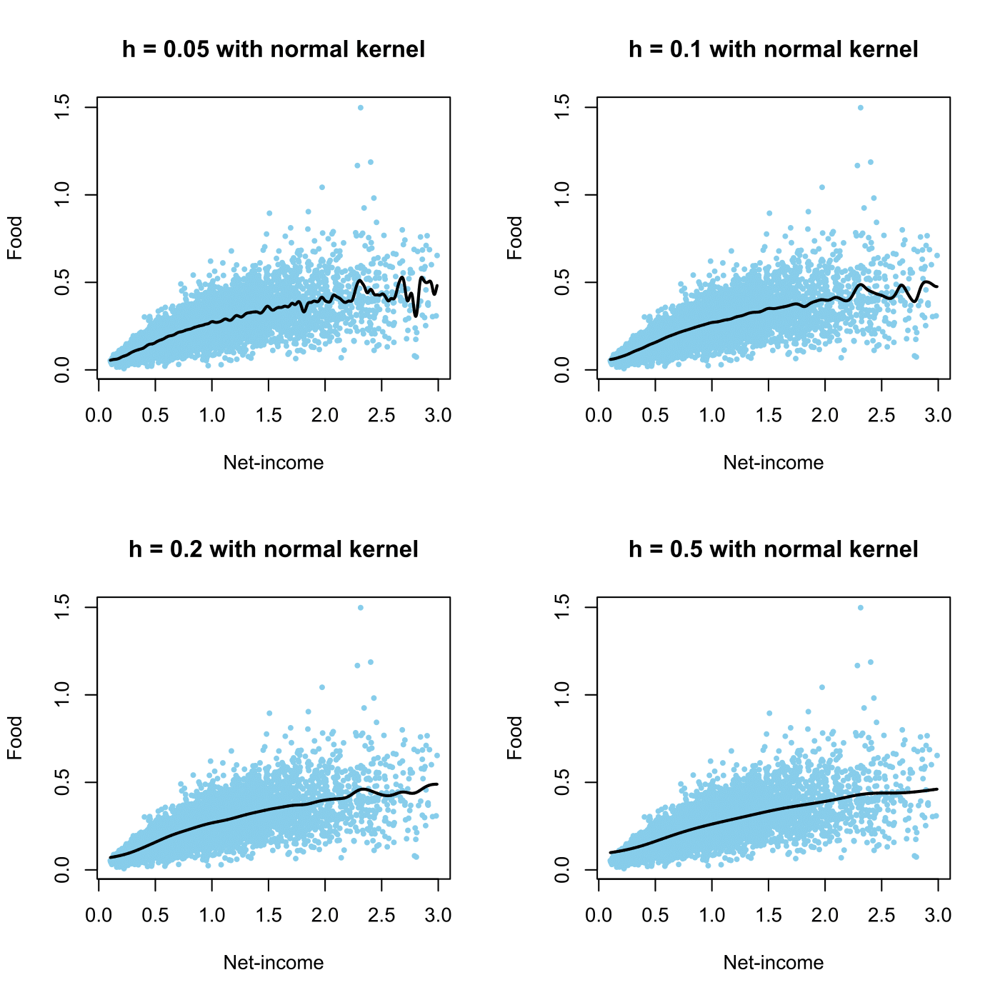

[](http://quantlet.de/index.php?p=info)

## [](http://quantlet.de/) **SPMregress** [](http://quantlet.de/d3/ia)

```yaml

Name of QuantLet : SPMregress

Published in : Nonparametric and Semiparametric Models

Description : 'Computes the regression of food expenditures on netincome with four different
bandwidths for the UK 1973 expenditure data.'

Keywords : bandwidth, kernel, regression, plot, graphical representation, data visualization

See also : SPMkernelregression, SPMorthogon

Author : Awdesch Melzer, Franziska Schulz

Submitted : Tue, November 12 2013 by Franziska Schulz

Datafiles : agg73sh.dat

```




```r

# clear variables and close windows
rm(list = ls(all = TRUE))
graphics.off()

# load data
x = read.table("agg73sh.dat")
x = cbind(x[, 1], x[, 4])
h = c(0.05, 0.1, 0.2, 0.5)
kernel = "normal"
mh = list()

for (i in 1:length(h)) {
    mh[[i]] = ksmooth(x[, 1], x[, 2], kernel = kernel, h[i])
}

par(mfrow = c(2, 2))
for (i in 1:length(h)) {
    plot(x, type = "n", main = paste("h =", h[i], "with", kernel, "kernel"), xlab = "Net-income", 
        ylab = "Food")
    points(x, col = "skyblue", pch = 20, cex = 0.7)
    lines(mh[[i]], col = "black", lwd = 2)
}
```
