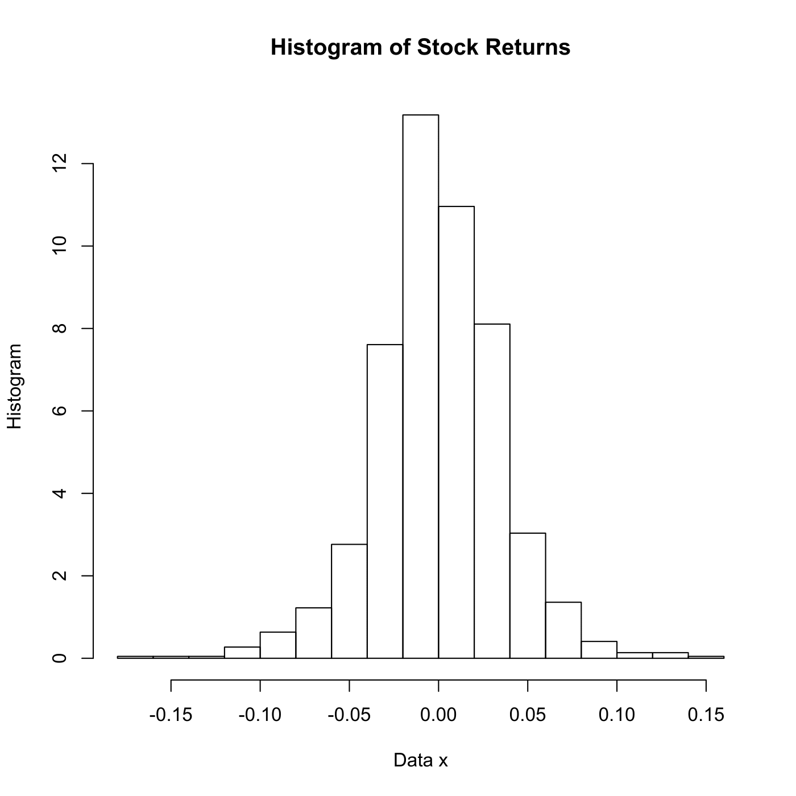

[](http://quantlet.de/index.php?p=info)

## [](http://quantlet.de/) **SPMhistogram** [](http://quantlet.de/d3/ia)

```yaml

Name of QuantLet : SPMhistogram

Published in : Nonparametric and Semiparametric Models

Description : Computes a histogram for stock returns data with binwidth h = 0.02 and origin x0 = 0.

Keywords : 'plot, graphical representation, data visualization, histogram, financial, returns,
asset, binwidth'

See also : 'SPMhisdiffbin, SPMhisdiffori, SPMhistmse, SPMhiststock, SPMstockreturnhisto,
SPMHistoConstruct, SPMhistobias2, SPMbuffahisto'

Author : Marlene Mueller

Submitted : Mon, March 15 2010 by Lasse Groth

Datafiles : stockres.txt

Input: 
- x0: origin
- h: binwidth

```




```r

# clear variables and close windows
rm(list = ls(all = TRUE))
graphics.off()

# load data
x = read.csv("stockres.txt") 
x = unlist(x)

x0 = 0     # Origin
h  = 0.02  # Binwidth

# Select bins
breaks = function(x, x0, h) {
    b = floor((min(x) - x0)/h):ceiling((max(x) - x0)/h)
    b = b * h + x0
    return(b)
}

# Plot histogram
hist(x, freq = FALSE, breaks = breaks(x, x0, h), main = "Histogram of Stock Returns", 
    xlab = "Data x", ylab = "Histogram")
```
