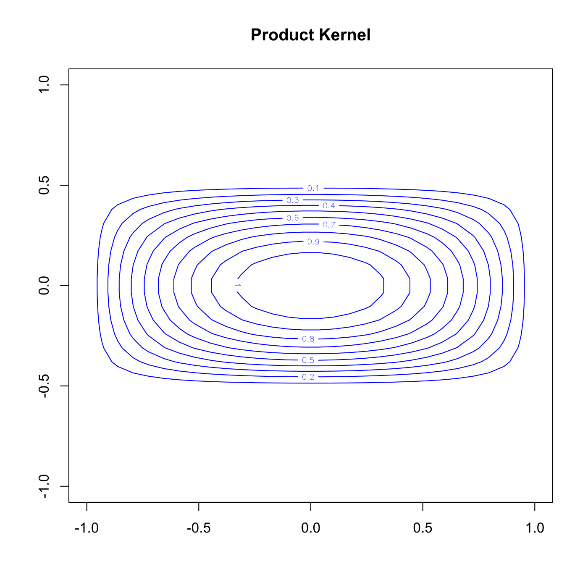
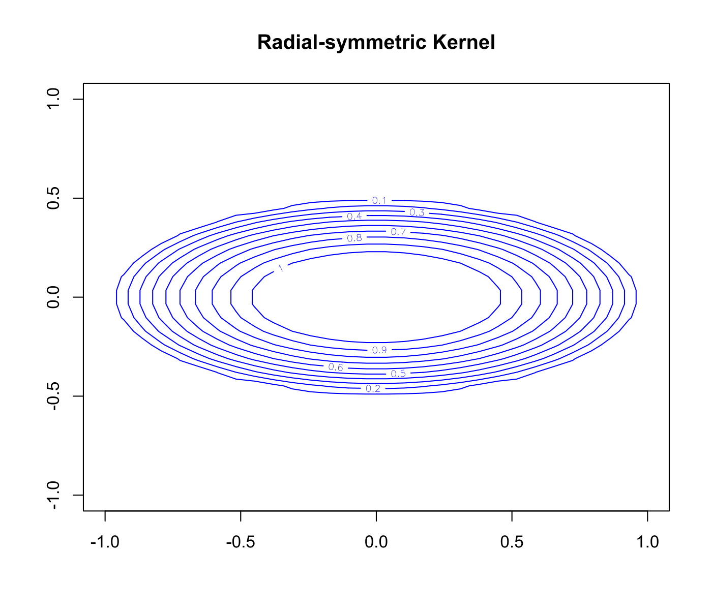

[](http://quantlet.de/)

## [](http://quantlet.de/) **SPMkernelcontours** [](http://quantlet.de/)

```yaml

Name of QuantLet : SPMkernelcontours

Published in : Nonparametric and Semiparametric Models

Description : 'Illustrates the difference between a bivariate product and a bivariate
radial-symmetric Epanechnikov kernel with equal bandwidths.'

Keywords : 'Epanechnikov, contour, bivariate, multivariate, kernel, plot, graphical representation,
data visualization'

See also : SPMkernel, SPMsplinekernel, SPMkernelregression

Author : Marlene Mueller

Submitted : Mon, May 10 2010 by Maria Osipenko

```






### R Code:
```r

# clear variables and close windows
rm(list = ls(all = TRUE))
graphics.off()

# Product Epanechnikov
product.Epa = function(u) {
    k = 0.75^2 * (1 - u[, 1]^2) * (1 - u[, 2]^2)
    k = k * (abs(u[, 1]) <= 1) * (abs(u[, 2]) <= 1)
    return(k)
}

# Spherical Epanechnikov
radial.Epa = function(u) {
    u = as.matrix(u)
    d = ncol(u)
    p = 2
    q = 1
    r = 1 - sqrt(rowSums(u * u))^p
    c = p * gamma(d/2) * gamma(1 + q + d/p)/(2 * pi^(d/2) * gamma(1 + q) * gamma(d/p))
    k = c * r^q * (r >= 0)
    return(k)
}

H1 = diag(2)  # identity matrix
H2 = diag(c(1, 0.5))  # diagonal matrix
H3 = 0.5 * diag(2) + 0.5  # general symmetric(!) matrix
H4 = matrix(c(0.5, 0.25, 0.25, 1), 2, 2)

H = H2  # ... change here! ....

# Plot kernels
u1 = u2 = seq(-1, 1, length = 30)
invH = chol2inv(chol(H))
grid = t(invH %*% t(expand.grid(u1, u2)))

P.Kernel = product.Epa(grid)/det(H)
P.Kernel = matrix(P.Kernel, length(u1), length(u2))

R.Kernel = radial.Epa(grid)/det(H)
R.Kernel = matrix(R.Kernel, length(u1), length(u2))

levels = seq(0.1, 1, length = 10)
contour(u1, u2, P.Kernel, levels = levels, col = "blue", main = "Product Kernel")

dev.new()
contour(u1, u2, R.Kernel, levels = levels, col = "blue", main = "Radial-symmetric Kernel")


```
