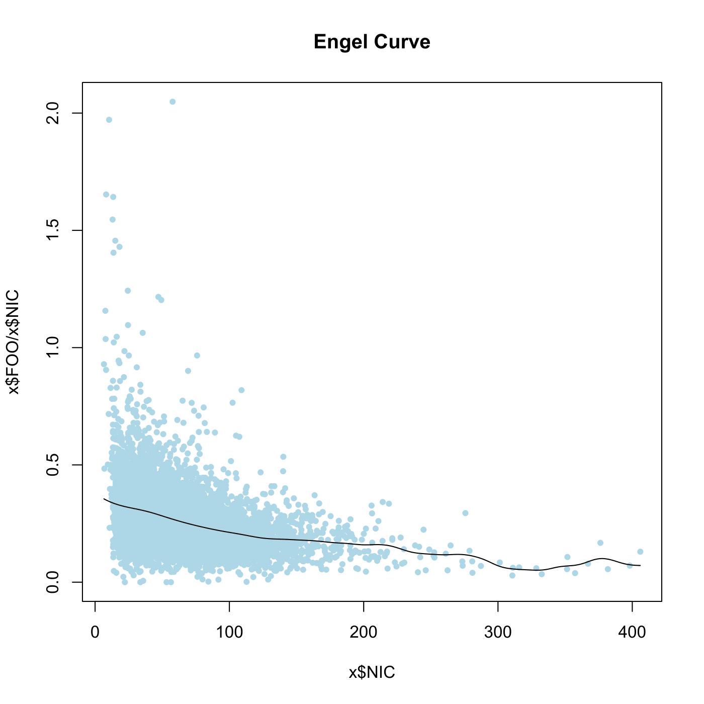

[](http://quantlet.de/index.php?p=info)

## [](http://quantlet.de/) **SPMengelcurve** [](http://quantlet.de/d3/ia)

```yaml

Name of QuantLet : SPMengelcurve

Published in : Nonparametric and Semiparametric Models

Description : Computes the regression of food share on net-income for the UK 1976 expenditure data.

Keywords : 'kernel, local polynomial, nonparametric, regression, plot, graphical representation,
data visualization'

See also : SPMengelcurve1, SPMengelconf, SPMengelconfsample, SPMspline, SPMsplineregression

Author : Marlene Müller

Submitted : Mon, May 10 2010 by Maria Osipenko

Datafiles : fes76.txt

```




```r

# clear variables and close windows
rm(list = ls(all = TRUE))
graphics.off()

# install and load packages
libraries = c("KernSmooth")
lapply(libraries, function(x) if (!(x %in% installed.packages())) {
install.packages(x)
})
lapply(libraries, library, quietly = TRUE, character.only = TRUE)

# load data
x = read.csv("fes76.txt", sep = ";", dec = ".")
x = x[, c("NIC", "FOO")]
x = x[order(x$NIC), ]
x = x[x$FOO/x$NIC <= 3, ]  # Delete unplausible food shares

plot(x$NIC, x$FOO/x$NIC, col = "lightblue", pch = 20, main = "Engel Curve")

# Estimate regression function using local polynomials.
mh = locpoly(x$NIC, x$FOO/x$NIC, degree = 0, kernel = "normal", bandwidth = 10)
lines(mh)
```
