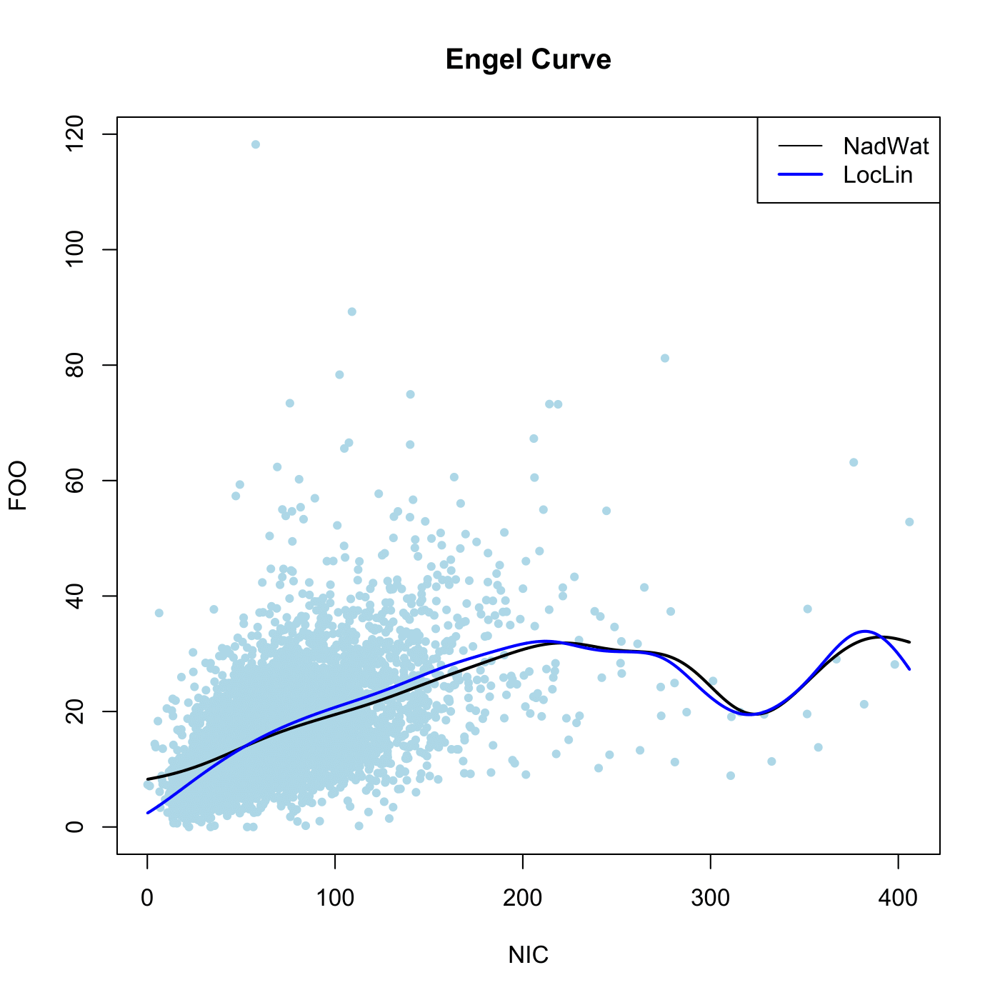

[](http://quantlet.de/index.php?p=info)

## [](http://quantlet.de/) **SPMlocpolyregression** [](http://quantlet.de/d3/ia)

```yaml

Name of QuantLet : SPMlocpolyregression

Published in : Nonparametric and Semiparametric Models

Description : 'Computes different regressions of food on net-income or the UK 1976 expenditure data
with Nadaraya Watson and with local linear regression.'

Keywords : 'Nadaraya Watson, kernel, local polynomial, nonparametric, regression, plot, graphical
representation, data visualization'

See also : SPMlocpolyest, SPMlocpolyderivative

Author : Marlene Mueller

Submitted : Mon, May 10 2010 by Maria Osipenko

Datafiles : fes76.txt

```




```r

# clear variables and close windows
rm(list = ls(all = TRUE))
graphics.off()

# install and load packages
libraries = c("KernSmooth")
lapply(libraries, function(x) if (!(x %in% installed.packages())) {
install.packages(x)
})
lapply(libraries, library, quietly = TRUE, character.only = TRUE)

# load data
x = read.csv("fes76.txt", sep = ";", dec = ".")
x = x[, c("NIC", "FOO")]
x = x[order(x$NIC), ]

# plot
plot(x, col = "lightblue", pch = 20, main = "Engel Curve")  # Plot data points
mh = locpoly(x$NIC, x$FOO, degree = 0, kernel = "normal", bandwidth = 20)  # Nadaraya-Watson regression
lines(mh, lwd = 2)
mh1 = locpoly(x$NIC, x$FOO, degree = 1, kernel = "normal", bandwidth = 20)  # Local linear regression
lines(mh1, col = "blue", lwd = 2)
legend("topright", c("NadWat", "LocLin"), col = c("black", "blue"), lwd = c(1, 2))

```
