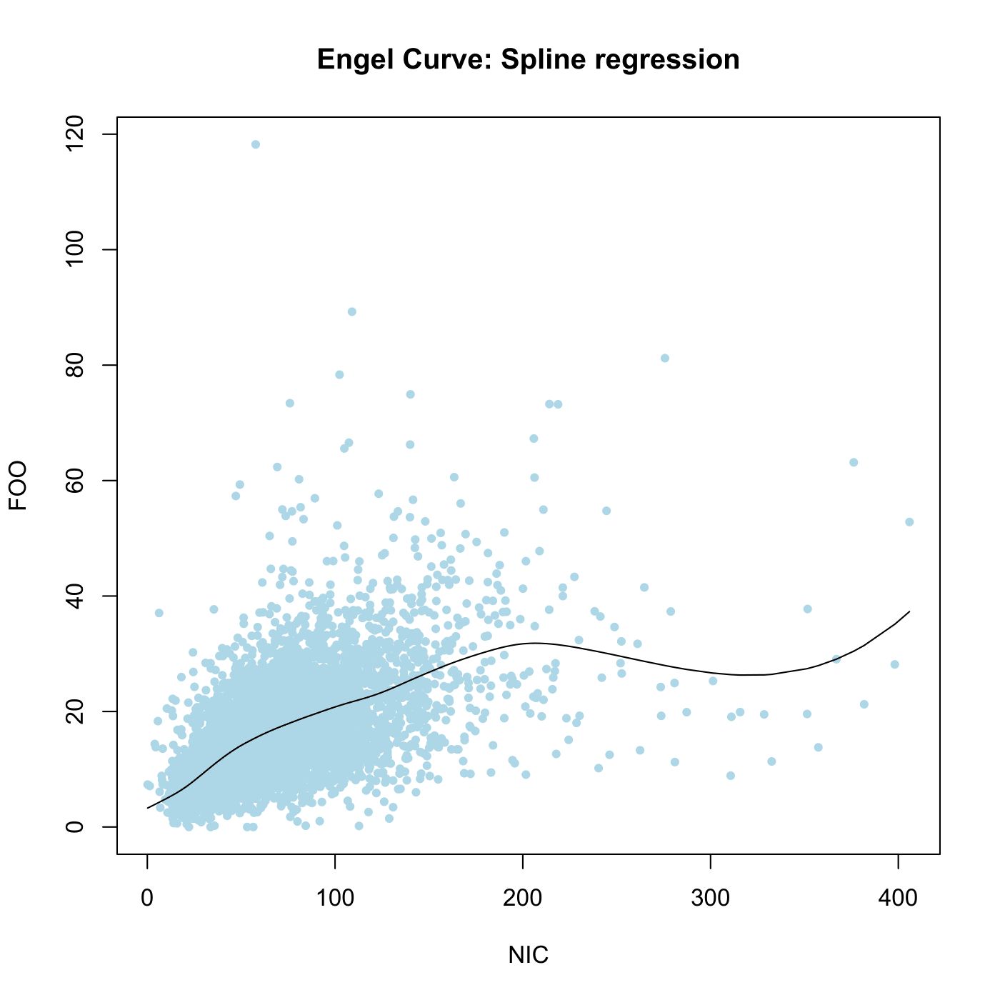

[](http://quantlet.de/index.php?p=info)

## [](http://quantlet.de/) **SPMsplineRegression** [](http://quantlet.de/d3/ia)

```yaml

Name of QuantLet : SPMsplineRegression

Published in : Nonparametric and Semiparametric Models

Description : Computes the regression of food on net-income for the UK 1976 expenditure data.

Keywords : 'nonparametric, regression, spline, financial, plot, graphical representation, data
visualization'

See also : 'SPMspline, SPMengelcurve, SPMengelcurve1, SPMengelconf, SPMengelconfsample,
SPMsplinekernel'

Author : Marlene Mueller

Submitted : Fri, January 28 2011 by Maria Osipenko

Datafiles : fes76.txt

```




```r

# clear variables and close windows
rm(list = ls(all = TRUE))
graphics.off()

# install and load packages
libraries = c("splines")
lapply(libraries, function(x) if (!(x %in% installed.packages())) {
install.packages(x)
})
lapply(libraries, library, quietly = TRUE, character.only = TRUE)

# load
x = read.csv2("fes76.txt", dec = ".")
x = x[, c("NIC", "FOO")]
x = x[order(x$NIC), ]

# plot
plot(x, col = "lightblue", pch = 20, main = "Engel Curve: Spline regression")
mh = smooth.spline(x$NIC, x$FOO, df = 10)
lines(x$NIC, fitted(mh))

```
