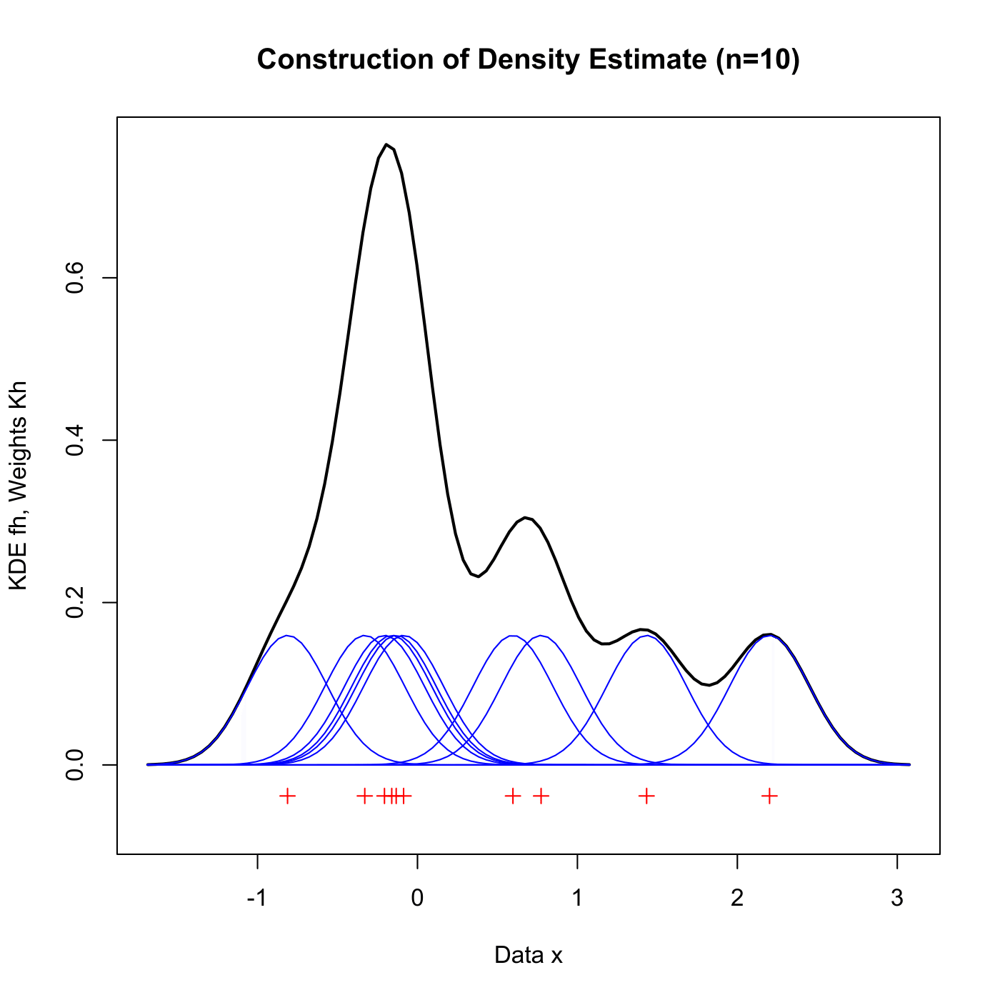

[](http://quantlet.de/index.php?p=info)

## [](http://quantlet.de/) **SPMkdeconstruct-Sliders** [](http://quantlet.de/d3/ia)

```yaml

Name of QuantLet : SPMkdeconstruct-Sliders

Published in : Nonparametric and Semiparametric Models

Description : 'Visualizes the construction of a kernel density estimate (with additional slider to
choose bandwidth and sample size).'

Keywords : plot, graphical representation, kernel, density, kde, nonparametric, regression

See also : SPMkdemse, SPMkdebias, SPMkdebias_sim, SPMkde2D, SPMkdeconstruct

Author : Marlene Mueller

Submitted : Wed, November 16 2011 by Dedy Dwi Prastyo

```




```r

# clear variables and close windows
rm(list = ls(all = TRUE))
graphics.off()

# install and load packages
libraries = c("tcltk", "TeachingDemos")
lapply(libraries, function(x) if (!(x %in% installed.packages())) {
install.packages(x)
})
lapply(libraries, library, quietly = TRUE, character.only = TRUE)

kde.refresh = function(...) {
    n = slider(no = 2)
    set.seed(19240215)
    x = rnorm(n)
    h = slider(no = 1)
    xr = diff(range(x))
    ng = 100
    xg = (xr + 7 * h) * (0:(ng - 1))/(ng - 1) + min(x) - 3.5 * h
    fk = matrix(0, nrow = ng, ncol = n)
    for (j in 1:n) {
        fk[, j] = dnorm((xg - x[j])/h)/(n * h)
    }
    fh = rowSums(fk)
    ylim = c(-0.1 * max(fh), max(fh))
    
    # plot
    plot(xg, fh, type = "l", lwd = 2, ylim = ylim, main = paste("Construction of Density Estimate (n=", 
        n, ")", sep = ""), xlab = "Data x", ylab = "KDE fh, Weights Kh")
    points(cbind(x, rep(-0.05 * max(fh), n)), col = "red", pch = 3)
    for (j in 1:n) {
        lines(xg, fk[, j], col = "blue")
    }
}

slider(sl.functions = kde.refresh, sl.names = c("Bandwidth", "Sample Size"), sl.mins = c(0.01, 
    1), sl.maxs = c(2, 100), sl.deltas = c(0.01, 1), sl.defaults = c(0.25, 10), title = "Choose KDE Construction Parameters")

```
